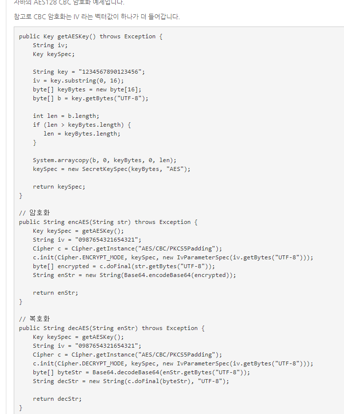
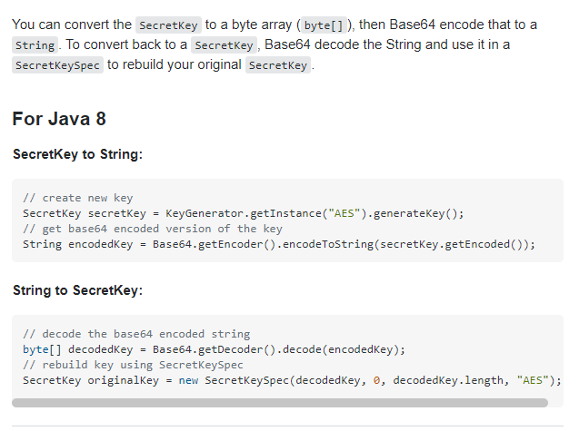
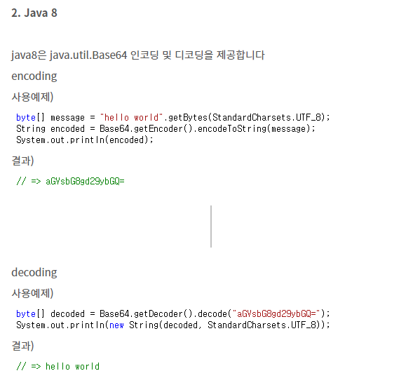
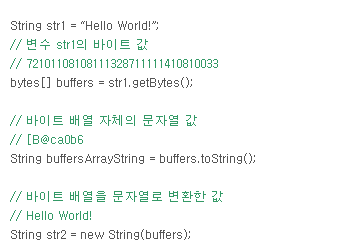

http://www.fun25.co.kr/blog/java-aes128-cbc-encrypt-decrypt-example

https://stackoverflow.com/questions/5355466/converting-secret-key-into-a-string-and-vice-versa

https://dev-syhy.tistory.com/15

https://roadrunner.tistory.com/139

