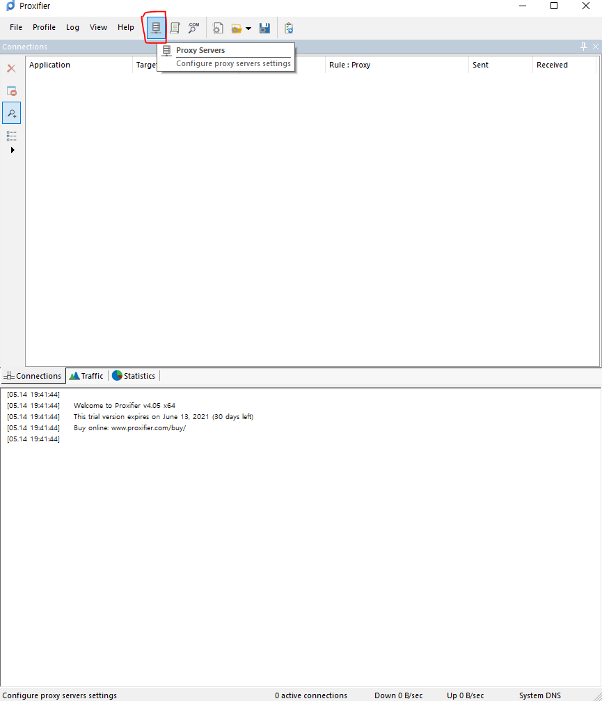
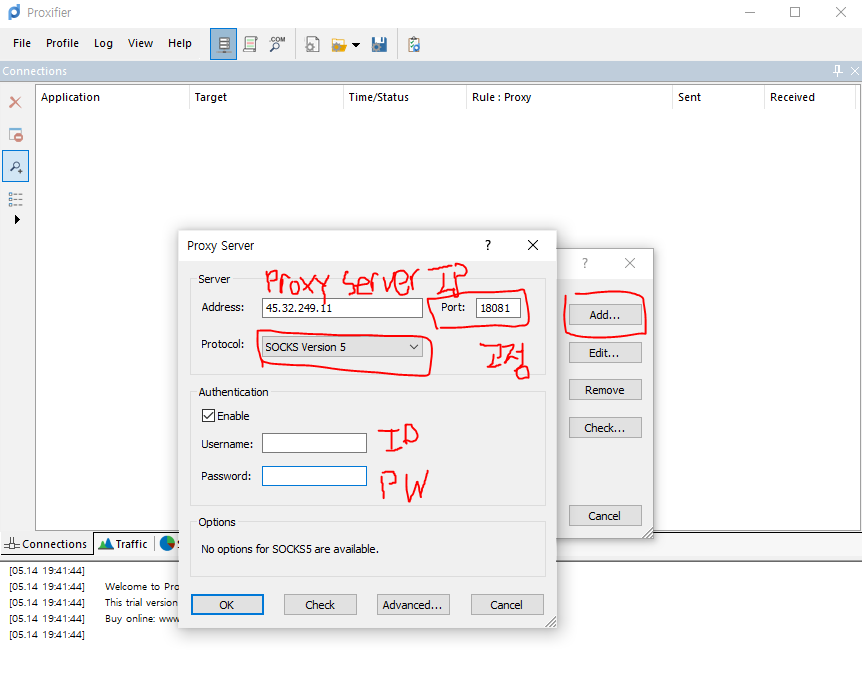
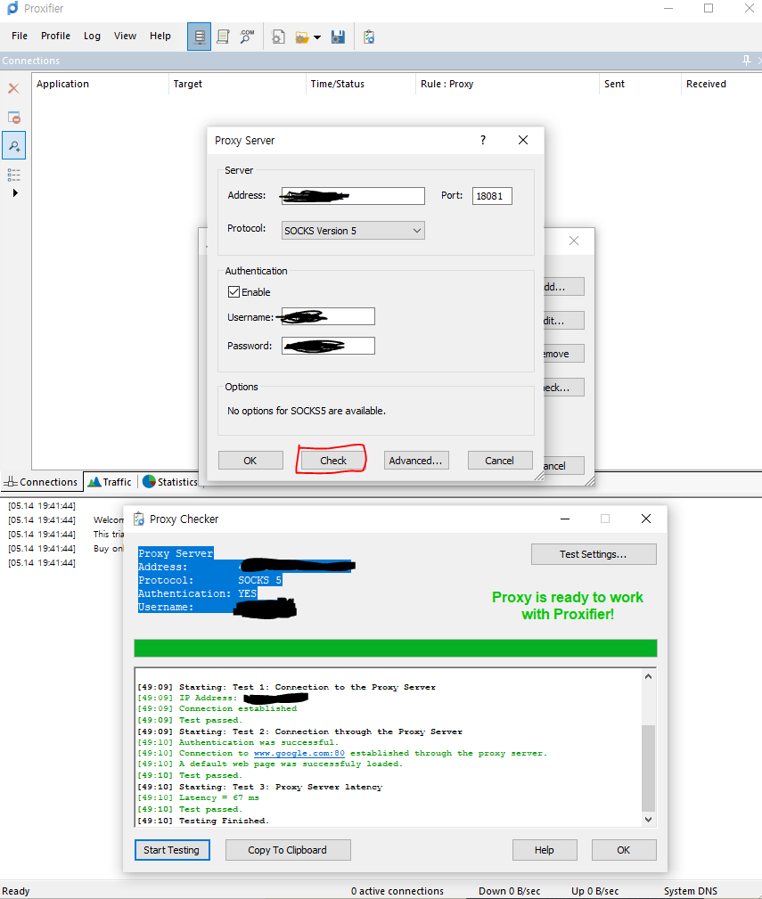
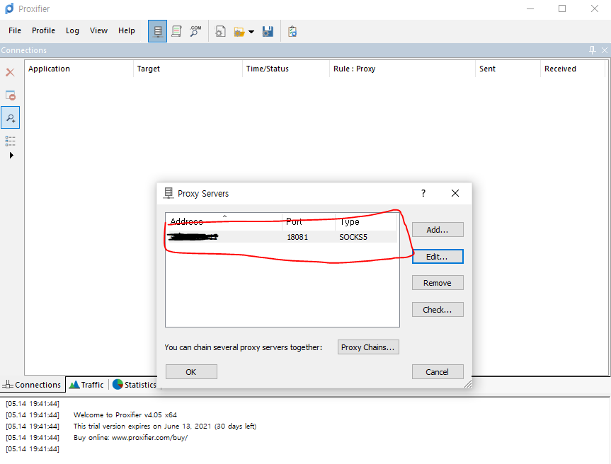
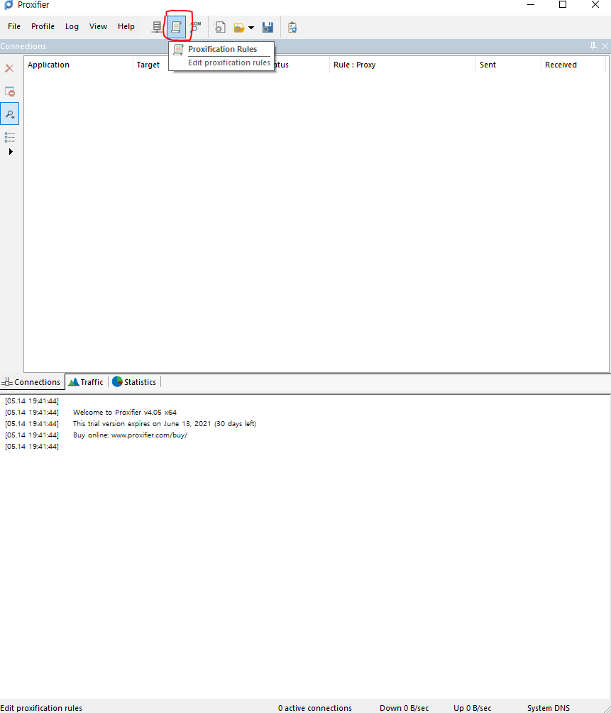
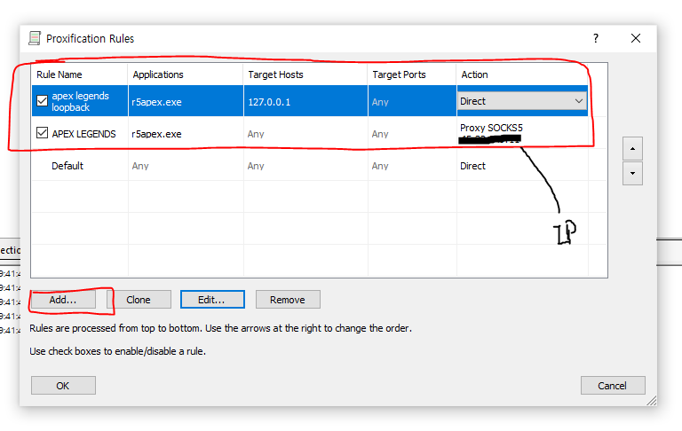
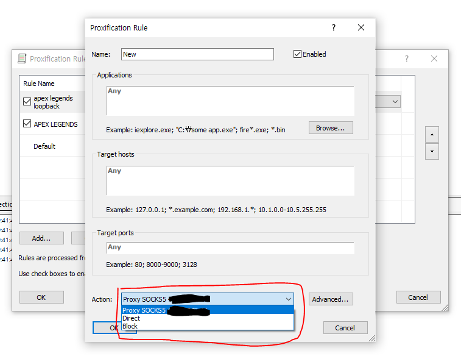
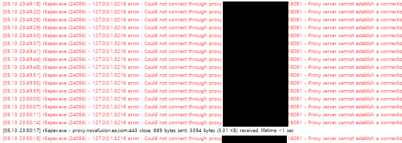
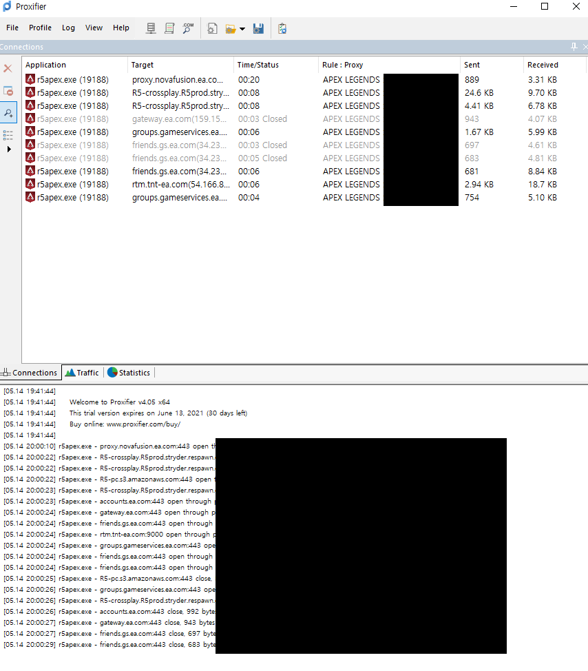

proxyfier + 미꾸라지 사용법 참고함

https://gall.dcinside.com/mgallery/board/view/?id=eft&no=10113

처음 다운로드하면 31일 체험판이됨

우선 프록시 서버정보를 저장할 프로파일을 만들어야한다

Add 눌러서 프록시 서버정보를 입력한다

- Address에는 프록시 서버주소를 입력하는데 미꾸라지에서 찾아서 넣으면 된다.
- https://mudfish.net/server/status
- 우리는 도쿄서버로 접속할꺼니까 JP Asia(Tokyo - <...>)중 하나 선택해서 고르면 된다.
  - 좀 아는애들은 apex 아이템 설정 - 중계서버 돋보기아이콘(아이템 RTT 상황)에서 패킷로스 확인할 수 있음

Check 눌러서 연결되는지 확인해주고

요래 한줄 생겼으면 성공

이제 규칙을 만든다

보면 두 줄로 만들었는데 따라 만들면 됨. 왜 두줄인지는 후술함

- 오리진 기준 application은 C:\Program Files (x86)\Origin Games\Apex 에 있다.

- 각 rules 옆에 체크박스 해제되어있으면 동작안한다. 꼭 체크하셈

아까 프록시 서버 프로파일 똑바로 만들었으면 여기 떠야됨

겜 실행할때 127.0.0.1:3216에 연결하려고하는데 프록시 걸려있으면 이리뜨면서 실패한다

잘 따라왔으면 이리됨. 이제 겜할때 proxifier만 키면 된다.

ㅅㄱ